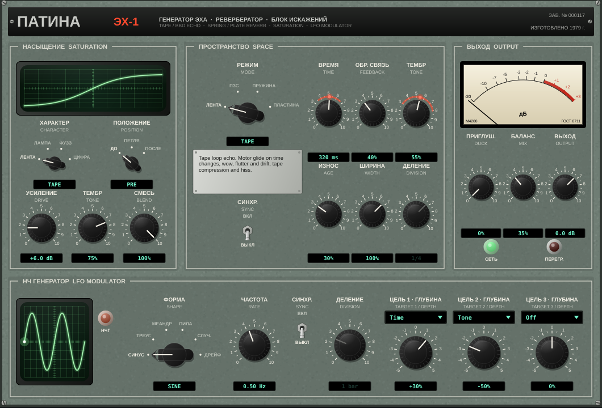

# Patina

A VST3 / AU effect that combines four vintage "space" machines with an oversampled saturation stage and an assignable LFO. It's built for Ableton Live and runs in any VST3 or AU host. The panel is styled after Soviet laboratory test equipment, with Cyrillic legends and English sub-legends.



| Space mode | What it models | What **Age** does |
|---|---|---|
| **Tape** | Tape-loop echo (Echoplex / Space Echo style). Changing Time glides the pitch like a varispeed motor. Head-bump high-pass and tape roll-off low-pass sit inside the loop, with tanh tape compression. | Wow, flutter, random drift, hiss, darker repeats |
| **BBD** | Bucket-brigade analog delay. Bandwidth falls as delay time rises, as with a real 4096-stage BBD clock. Op-amp hard knee in the loop. | Chorus wobble depth, compander noise, darker repeats |
| **Spring** | Two-spring-per-side tank. Cascaded stretched allpasses supply the dispersion behind the "drip" chirp, and the loop rolls off at about 4.5 kHz. | Input-transformer drive (more "boing"), tank wander |
| **Plate** | EMT 140-style plate built on Dattorro's figure-of-eight tank. | Deeper modulation, duller damping |

**Saturation** offers four characters:

- **Tape**: biased tanh, with a little 2nd harmonic.
- **Tube**: asymmetric triode curve, rich in even harmonics.
- **Fuzz**: germanium-style asymmetric clip.
- **Crush**: bit and sample-rate reduction.

Each character can sit in one of three positions:

- **Pre**: drives the input before the space engine. Dry and wet are both saturated.
- **Space**: inside the effect. For Tape/BBD it saturates the echo regeneration loop, so each repeat gets dirtier. For Spring/Plate it overdrives the tank input, like a cranked reverb driver.
- **Post**: drives the final mix.

Pre and Post run at 4x oversampling. Latency stays fixed at about 60 samples in every position, and Live compensates it automatically.

## Controls

| Section | Control | Notes |
|---|---|---|
| Saturation | Character, Position, Drive (0–36 dB), Tone, Blend | Blend is a parallel mix. Make-up gain is automatic. |
| Space | Mode, Time (10 ms–2 s) or Sync + Division, Feedback (0–110 %) | Tape/BBD. Feedback above 100 % self-oscillates but stays limited by the loop saturation. |
| Space | Pre-Delay (0–300 ms), Decay (0.3–12 s) | Spring/Plate. |
| Space | Tone, Age, Width (0–150 %) | Shared by all modes. |
| Output | Duck, Mix, Output | Duck pulls the wet signal down while the input plays. Mix is equal-power. |
| LFO | Shape, Rate (0.02–20 Hz) or Sync + Division (1/32 to 8 bars), three Target/Depth slots | See below. |

## LFO (НЧ генератор)

One LFO with six shapes: Sine, Triangle, Square, Saw, Sample & Hold and Drift (smoothed random). It feeds three assignment slots. Each slot picks a target and a bipolar depth:

- **Targets:** Time, Feedback, Pre-Delay, Decay, Tone, Age, Width, Mix, Drive, Sat Tone, Sat Blend.
- **Depth:** at ±100 % the LFO sweeps the target across its whole range around the knob's position. Slots that share a target add together.
- **Sync:** when on and Live's transport is running, the LFO locks to the song position, so it lands the same way on every playback.

Modulated knobs show a red arc for the modulation range and a moving dot for the live value.

Time modulation passes through the echo engine's own motor glide. Slow rates give pitch-bending tape warble; fast rates get smoothed out, as they would on a real machine.

Switching modes crossfades over 40 ms, so you can automate it. There are eleven factory programs: three of them use the LFO (Seasick Tape, Breathing Plate, Stuttering Spring). Live does not show VST3 programs in its menus, so save your own sounds with Live's device preset button.

## Getting the plugin

### Download a build (no compiler needed)
Every push builds Windows, macOS (universal) and Linux binaries with GitHub Actions. Open the repo's **Actions** tab, pick the latest successful **Build** run, and download `Patina-Windows-VST3` or `Patina-macOS-VST3` / `Patina-macOS-AU`.

Install:
- **Windows**: copy `Patina.vst3` to `C:\Program Files\Common Files\VST3\`.
- **macOS**: copy `Patina.vst3` to `~/Library/Audio/Plug-Ins/VST3/` and `Patina.component` to `~/Library/Audio/Plug-Ins/Components/`. The builds are unsigned, so clear the quarantine flag once:
  `xattr -cr ~/Library/Audio/Plug-Ins/VST3/Patina.vst3 ~/Library/Audio/Plug-Ins/Components/Patina.component`

Then in Live: **Settings → Plug-Ins**, turn on **Use VST3 Plug-In System Folders** (and on macOS, **Use Audio Units**), and click **Rescan**. Patina appears under **Plug-Ins → Tomas Balvin**.

### Build it yourself
Requirements: CMake ≥ 3.22 and a C++17 compiler (Visual Studio 2022, Xcode 14+, or GCC/Clang). CMake downloads JUCE 8.0.9 automatically.

```bash
cmake -B build -DCMAKE_BUILD_TYPE=Release
cmake --build build --config Release
```

On macOS, add `-G Xcode` if you prefer. To use an existing JUCE checkout, pass `-DPATINA_JUCE_DIR=/path/to/JUCE`.

The output lands in `build/Patina_artefacts/Release/` (`VST3/`, `AU/` on macOS, and `Standalone/`).

## Testing

`-DPATINA_BUILD_TESTS=ON` adds `PatinaHostTest`. This headless host loads the built VST3 and runs these checks:

- renders impulses through every mode
- checks wet level against the input
- runs every preset
- stress-tests every mode × saturation type at maximum drive, feedback and age, checking for NaN and runaway output
- round-trips the plugin state

It writes WAV renders to `./renders/`. CI also runs [pluginval](https://github.com/Tracktion/pluginval) at strictness 10.

## Source layout

```
Source/
  PluginProcessor.*      parameters, routing, tempo sync, mode crossfade, LFO routing, presets
  PluginEditor.*         Soviet test-equipment UI: knobs, selectors, CRT, meter, lamps
  dsp/Primitives.h       delay line (Hermite), SVF, one-poles, noise, drift
  dsp/Saturation.h       shapers and the oversampled block saturator
  dsp/EchoEngine.h       Tape and BBD echoes
  dsp/SpringEngine.h     dispersive spring tank
  dsp/PlateEngine.h      Dattorro plate
  dsp/Lfo.h              LFO shapes and transport-locked phase
tools/HostTest.cpp       headless validation host
```
